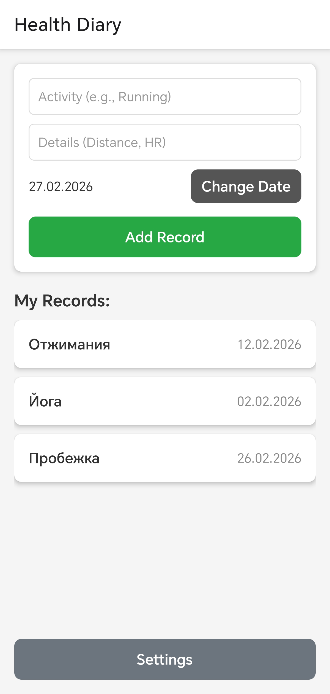
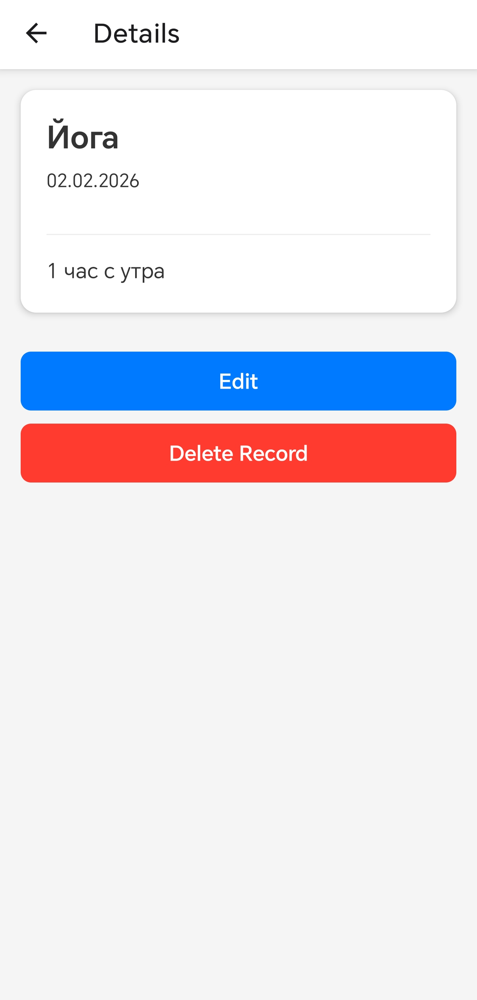
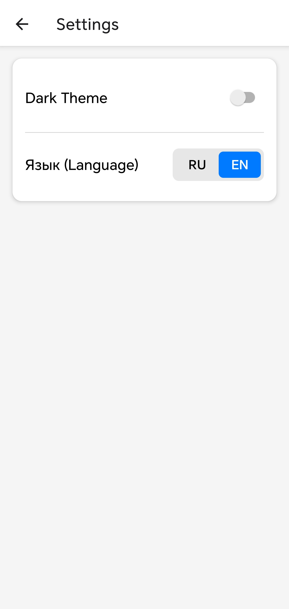

# 📓 HealthDiary


A mobile application for tracking daily physical activity and health metrics. Built with React Native and Expo.

*Note: This project serves as a solid foundation and will be actively expanded with new features in the future.*

---

## Screenshots

### Mobile View

| Home Screen | Details & Edit | Settings |
|:---:|:---:|:---:|
|  |  |  |

---

## Features

**Summary:**
- Create, read, update, and delete (CRUD) health records
- Store all data locally using AsyncStorage so it persists between app launches
- Pick custom dates for your records using a native calendar module
- Navigate smoothly between 3 main screens (Home, Details, Settings)
- Enjoy a native splash screen during app initialization

**Bonus features implemented:**
- Dark / Light theme toggle - your preference is saved locally
- Localization support (English and Russian) - switch languages on the fly
- Custom modal dialogs for safe record deletion and editing
- Form validation to prevent saving empty records

---

## How to Run the App

**Prerequisites:** Node.js, npm, and the **Expo Go** app installed on your physical Android or iOS device.

### Development

Clone the repository and install dependencies:

```bash
git clone https://github.com/zen1xAL/health-diary.git
cd HealthDiary
npm install
Start the Expo development server:

```bash
npx expo start -c
```

1. Open the **Expo Go** app on your phone.
2. Scan the QR code displayed in your computer's terminal.
3. The app will build and open on your device with hot-reload enabled.

---

## Project Structure

```text
src/
├── components/            - Reusable UI elements
│   ├── CustomButton.tsx   - Styled touchable button
│   └── RecordCard.tsx     - Card component for the list view
│
├── context/               - Global state management
│   ├── DiaryContext.tsx   - Logic for AsyncStorage and CRUD operations
│   └── ThemeContext.tsx   - Logic for dark/light mode toggle
│
├── i18n/                  - Localization configuration
│   └── index.ts           - Dictionaries for EN and RU languages
│
├── navigation/            - Router configuration
│   └── AppNavigator.tsx   - Stack navigator and screen routes
│
├── screens/               - Main application views
│   ├── HomeScreen.tsx     - Form to add records and the FlatList
│   ├── DetailsScreen.tsx  - View, edit, and delete specific records
│   └── SettingsScreen.tsx - Theme and language toggles
│
└── types/                 - TypeScript definitions
    └── index.ts           - Interfaces for records and navigation params
```

| Folder | Purpose |
|---|---|
| `src/components/` | Custom UI elements to keep screens clean and DRY |
| `src/context/` | React Context providers for global state and storage |
| `src/i18n/` | Language dictionaries and i18next configuration |
| `src/navigation/` | Screen routing using React Navigation |
| `src/screens/` | The main pages displayed to the user |
| `src/types/` | Strict TypeScript models to prevent runtime errors |

---

## Author

Made by **Alexander Vlasovets**, group **351002**, **BSUIR**, as part of the Mobile Development course.